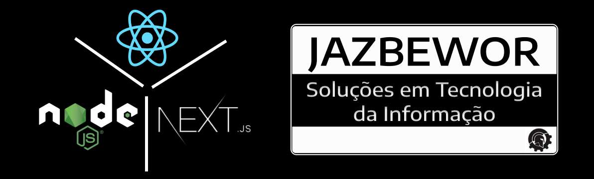

<p align="center">
  
</p>

<p align="center">
  

  

</p>
<br>

A TypeScript starter for Next.js that includes all you need to build amazing projects 🔥

- 📏 **ESLint** — Pluggable JavaScript linter;
- 💖 **Prettier** — Opinionated Code Formatter;
- 🐶 **Husky** — Use git hooks with ease;
- 📄 **Commitizen** — Conventional commit messages CLI;
- 🚓 **Commitlint** — Lint commit messages;
- 🖌 **Renovate** — Dependency update tool;
- 🚫 **Lint-Staged** — Run linters against staged git files;
- 🗂 **Absolute import** — Import folders and files using the `@` prefix;
- 🎨 **Styled-Components** — Style control via components;
- 🌔 **Babel** — Styled-components configuration for next.js and importing images as components;

## 🧰 Tools

  
  
  

## 🚀 Getting started

The best way to start with this model is to glone the repository `git clone ...`

```
git clone git@github.com:zugzwangbw/reactjs-nextjs-structure-jazbeworts.git
```

If you prefer you can clone this repository and run the following commands inside the project folder:

1. `npm install` or `yarn`;
2. `npm run dev` or `yarn dev`;

To view the project open `http://localhost:3000`.

## 🤝 Contributing

1. Fork this repository;
2. Create your branch: `git checkout -b my-new-feature`;
3. Commit your changes: `git commit -m 'Add some feature'`;
4. Push to the branch: `git push origin my-new-feature`.

**After your pull request is merged**, you can safely delete your branch.

## 📝 License

This project is licensed under the MIT License - see the [LICENSE.md](LICENSE.md) file for more information.

---

Made by Elson Júnior
<br>

